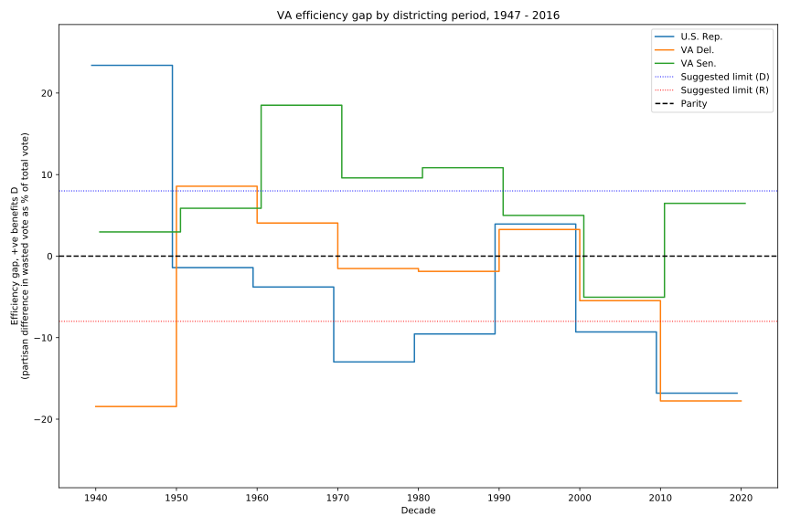

# Virginia Efficiency Gap 1947-2016

## Context

Partisan [gerrymandering](https://en.wikipedia.org/wiki/Gerrymandering)
 is generally considered to be an obstructor to true representative
 democracy. The
 [efficiency gap](https://papers.ssrn.com/sol3/papers.cfm?abstract_id=2457468)
 metric is one way to measure the extent to which a particular district
 map benefits one party or the other in a bipartisan system: it measures
 the partisan difference in wasted votes (across the state) as a
 proportion of total votes cast, where a wasted vote is any vote for a
 losing candidate, or any votes more than `floor(total_votes / 2 + 1)`
 for the winning candidate.

This script applies the efficiency gap measure to Virginia's General
Assembly and US Representative elections over the last 60 years, using
data pulled from http://historical.elections.virginia.gov/.

For simplicity, votes cast for candidates other than Republican and
Democratic are ignored. The efficiency gap works on the district map as
a whole, rather than on any single district. To get a sense of the
general balance of the district map, this script also sums across all
elections for a particular office held within the decade for which the
district map persisted.


## Results




While historically the district maps have varied in their partisan
favour, in the last decade the VA and US House district maps have
heavily favoured the Republican party - they have allowed the conversion
of votes into seats at a rate nearly 20% higher than the Democrats


## Issues

- At time of writing, the 2017 elections' results are not finalsed. The
efficiency gap is particularly sensitive to results in marginal
seats, so this election is ignored for now.

- The efficiency gap works on votes, and as such can say nothing about
factors influencing those who did not vote at all. Uncontested seats
have been ignored in this analysis for that reason, but low turnout by
opposition voters in safe but technically contested seats is a potential
confound.


## Dependencies

- Python >=3.6

```bash
pip install -r requirements.txt
```

## Usage

```bash
python3 -m va_efficiency path/to/figure.png
```

Path defaults to `figure.png`
